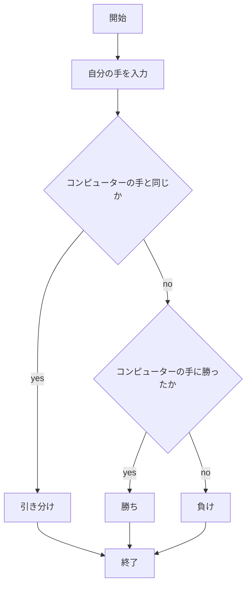
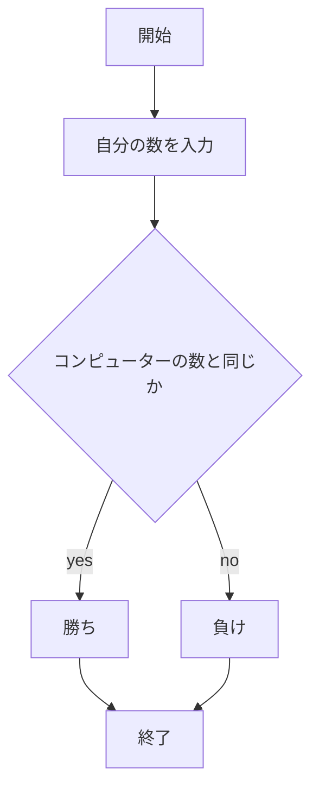
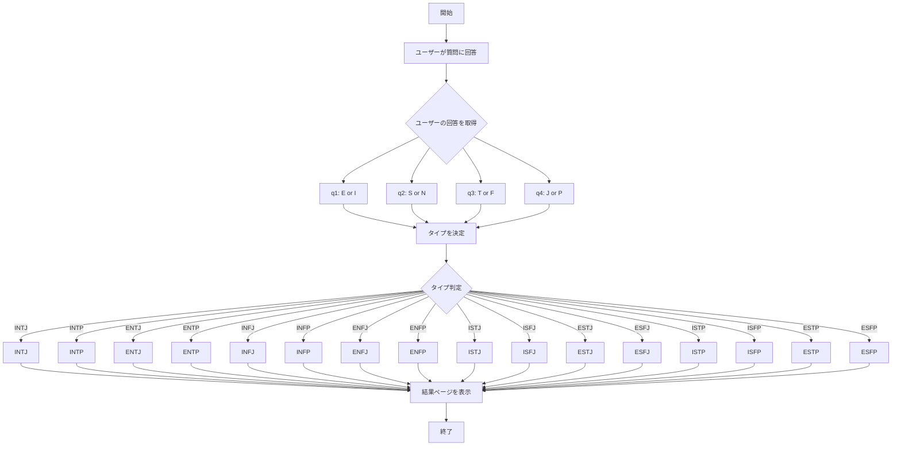
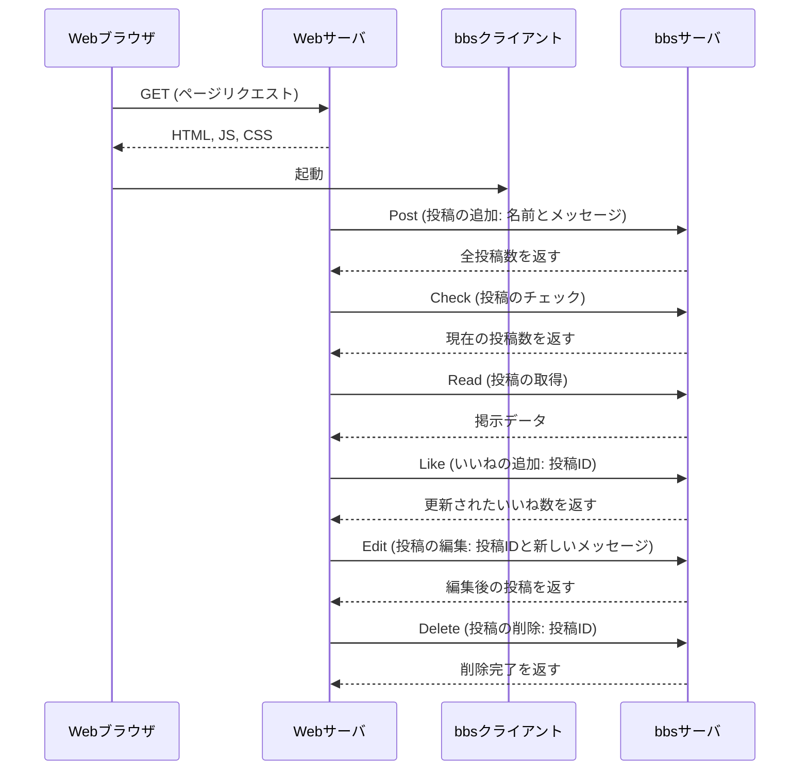

# webpro_06

## このプログラムについて

## ファイル一覧
ファイル名 | 説明
-|-
app5.js | プログラム本体
public/janken.html | じゃんけんの開始画面
views/janken.ejs | じゃんけんのテンプレートファイル
public/guess.html | 数字当てゲームの開始画面
views/guess.ejs | 数字当てゲームのテンプレートファイル
public/mbti.html | MBTI診断の開始画面
views/mbti.ejs | MBTI診断のテンプレートファイル

## 1.じゃんけん
1. app5.js を起動する
1. Webブラウザでlocalhost:8080/public/janken.htmlにアクセスする
1. 自分の手を入力する

## 2.数字当てゲーム
1. app5.js を起動する
1. Webブラウザでlocalhost:8080/public/guess.htmlにアクセスする
1. 自分の数を入力する

## 3.MBTI診断
1. app5.js を起動する
1. Webブラウザでlocalhost:8080/public/mbti.htmlにアクセスする
1. 4つの質問に答える．

## 4.掲示板
1. app8.js を起動する
1. Webブラウザでlocalhost:8080/public/bbs.htmlにアクセスする
1. 名前とメッセージを入力する
1. 投稿チェックボタンを押す
1. いいね，投稿編集，投稿削除ができる

